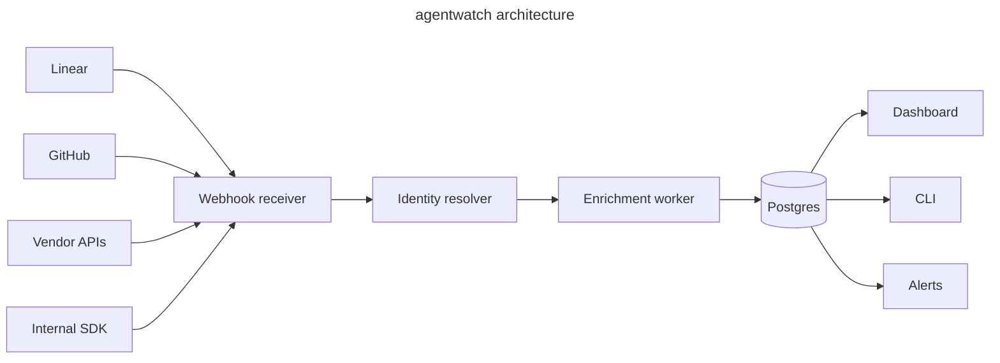

<p align="center">
  <picture>
    <source media="(prefers-color-scheme: dark)" srcset="LOGO_DARK_URL">
    <source media="(prefers-color-scheme: light)" srcset="LOGO_LIGHT_URL">
    
  </picture>
</p>
<!-- TODO: Replace LOGO_DARK_URL and LOGO_LIGHT_URL, or remove the <picture> block and use a text header -->

<p align="center">
  <a href="LICENSE"></a>
  <a href="RELEASES_URL"></a>
  <a href="CI_URL"></a>
  <a href="DISCORD_URL"></a>
</p>

<p align="center"><strong>Cost, reliability, and lineage for the agents working in your Linear workspace.</strong></p>

---

<p align="center">
  
</p>
<!-- TODO: Replace DASHBOARD_SCREENSHOT_URL with a real screenshot or GIF of the dashboard -->

## Why agentwatch

Cursor, Devin, Codex, Sentry's Seer, and your own internal agents are all working tickets in Linear. Each vendor shows you their own session log. Linear shows you the comment thread. Nobody shows you the cross-agent view: what every agent did this week, what it cost, what worked, and what got reverted three days later.

agentwatch is the observability layer for that mess. Self-hosted, Postgres-only, one Docker compose command to run.

## Features

- **Cost attribution per agent** — spend per agent per team per cycle, with cost-per-closed-issue as a derived metric.
- **Reliability telemetry** — success rate, revert-within-7-days, time-to-resolution, broken out per agent.
- **Cross-agent lineage** — for any issue, the timeline of which agents touched it and what each one did.
- **YAML-defined alerts** — cost anomalies and reliability regressions, with a community rule-pack format.
- **CLI and dashboard** — same query API behind both. Pipe results into your tools or browse them in a UI.
- **Vendor-neutral** — Cursor, Devin, Codex, Seer, and homegrown agents via the SDK, all in one schema.

## How it works



Linear webhooks (Agent Session events) are the spine. GitHub provides the outcome signal — was the PR merged, reverted, did CI pass. Vendor APIs supply cost data where exposed. Everything stitches into one `agent_session_id` and lands in Postgres.

## Quick start

> [!IMPORTANT]
> Requires Docker 24+ and a Linear workspace on the Business or Enterprise plan (for Agent Session webhook access).

```bash
git clone https://github.com/YOUR_USERNAME/agentwatch.git
cd agentwatch
cp .env.example .env
# edit .env with your Linear OAuth credentials and GitHub PAT
docker compose up -d
```

Open `http://localhost:3000` and complete the workspace setup wizard. First data appears within minutes of your next agent activity.

## Installation

> [!NOTE]
> Self-hosted only. There is no managed cloud version yet — see [Roadmap](#roadmap).

<table>
  <tr><th>Method</th><th>Best for</th><th>Command</th></tr>
  <tr><td>Docker Compose</td><td>Most users</td><td><code>docker compose up -d</code></td></tr>
  <tr><td>Helm chart</td><td>Kubernetes</td><td><code>helm install agentwatch agentwatch/agentwatch</code></td></tr>
  <tr><td>From source</td><td>Contributors</td><td><code>pnpm install && pnpm dev</code></td></tr>
</table>

## Configuration

> [!IMPORTANT]
> `LINEAR_CLIENT_ID`, `LINEAR_CLIENT_SECRET`, and `DATABASE_URL` are required. Everything else is optional.

| Variable | Required | Default | Description |
|----------|----------|---------|-------------|
| `LINEAR_CLIENT_ID` | Yes | — | OAuth app ID with `actor=app` scope |
| `LINEAR_CLIENT_SECRET` | Yes | — | OAuth app secret |
| `DATABASE_URL` | Yes | — | Postgres connection string |
| `GITHUB_PAT` | No | — | Personal access token; enables PR outcome tracking |
| `CURSOR_API_KEY` | No | — | Enables Cursor cost enrichment |
| `DEVIN_API_KEY` | No | — | Enables Devin cost enrichment |
| `TELEMETRY_OPT_IN` | No | `false` | Send anonymized aggregates to the public benchmark |
| `LOG_LEVEL` | No | `info` | `debug`, `info`, `warn`, `error` |

<details>
<summary>Full configuration reference</summary>

See [docs/configuration.md](docs/configuration.md) for the complete list, including SMTP for email alerts, Slack webhook URLs, custom retention windows, and database tuning flags.

</details>

## Usage

### CLI

```bash
# Cost per agent over the last cycle
agentwatch query "spend by agent last 14d"

# Reliability snapshot
agentwatch report reliability --team ENG

# Lineage for a specific issue
agentwatch lineage LIN-1234

# Tail live agent activity
agentwatch tail
```

### Dashboard

Three views, all reading the same query API as the CLI:

- **Cost** — spend per agent per team, cost-per-closed-issue, anomaly highlights
- **Reliability** — success rate, revert rate, time-to-resolution distributions
- **Lineage** — per-issue timeline of every agent that touched it

### Alert rules

Define rules in YAML. Drop them in `./rules/` or contribute them to the community pack.

```yaml
# rules/cost-spike.yaml
name: agent_cost_spike
when: agent.weekly_spend > 3 * agent.rolling_avg(28d)
notify:
  - slack: "#eng-alerts"
  - email: "ops@example.com"
```

## Telemetry and privacy

> [!NOTE]
> Telemetry is **off by default** and customer data never leaves your instance.

If you opt in via `TELEMETRY_OPT_IN=true`, agentwatch sends only the following to a separate hosted aggregator: agent name, anonymized cost bucket, success/fail outcome, and model tier. No issue content, no code, no identifiers. The opt-in dataset powers the public benchmark at [BENCHMARK_URL](BENCHMARK_URL). See [docs/telemetry.md](docs/telemetry.md) for the full schema.

## Roadmap

- [x] Linear Agent Session ingestion
- [x] GitHub PR outcome correlation
- [x] Cost / reliability / lineage dashboards
- [x] CLI parity with dashboard
- [ ] GitHub Issues source (beyond just PR outcomes)
- [ ] Jira source
- [ ] Hosted version with SSO and audit logs
- [ ] Custom dimensions for multi-product workspaces

## FAQ

<details>
<summary>How is this different from what Linear ships natively?</summary>

Linear's Triage Intelligence and Linear Agent are excellent at *operating inside Linear*. agentwatch operates *across* the agent stack — it correlates Linear events with GitHub outcomes and vendor cost data into a single agent identity. Linear has structural reasons to favor its own agent; agentwatch is vendor-neutral by design.

</details>

<details>
<summary>Will this work with internal / homegrown agents?</summary>

Yes. The `@agentwatch/sdk` package emits cost, duration, and outcome events from any agent runtime. See [docs/sdk.md](docs/sdk.md).

</details>

<details>
<summary>Does it work without GitHub?</summary>

You can run it Linear-only, but you lose the revert-rate and PR-outcome signals — which are the most useful reliability metrics. We strongly recommend connecting GitHub.

</details>

<details>
<summary>What about Jira / Asana / GitHub Issues?</summary>

On the roadmap. v0 is Linear-only on purpose — go deep before going wide.

</details>

## Contributing

PRs welcome. Good first issues are tagged [`good-first-issue`](ISSUES_URL). For larger changes, please open an issue first to discuss the approach. See [CONTRIBUTING.md](CONTRIBUTING.md) for development setup and conventions.

## License

[MIT](LICENSE) © YOUR_NAME
